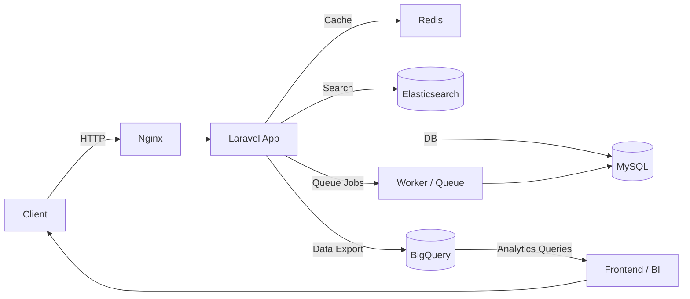

# 👋 Hi, I'm Michele

  

---

## 🚀 About me

💻 **Full Stack Developer** with a strong backend and infrastructure mindset.

* 🧠 Problem solver — I focus on *solutions that actually work in production*
* ⚙️ Deep interest in **architecture, performance and system design**
* 🧼 Clean code enthusiast (yes, formatting matters 😄)
* 🔐 Focus on reliability, security and long-term maintainability

---

## 🧰 Tech Stack

### Core Stack

### Ecommerce Platforms

### Infrastructure & Runtime

### Data & Analytics

---

## 🧠 Deep Dive — Backend & Architecture

What I enjoy the most is designing systems that are:

* **Predictable under load**
* **Easy to debug**
* **Maintainable over time**
* **Data-consistent**

### My approach

* Separate concerns strictly (API / domain / infrastructure)
* Prefer **stateless services** when possible
* Use queues and async workflows to decouple heavy operations
* Design DB schemas with query patterns in mind (not just structure)
* Avoid over-engineering — but also avoid future pain

### Typical patterns I use

* REST APIs with clear boundaries
* Queue-based processing (jobs, events)
* Caching layers (Redis) to reduce DB pressure
* Data pipelines (BigQuery + scheduled queries)
* Reverse proxy + optimized Nginx configs
* Containerized environments (Docker)

---

## 🧱 Example Architecture (high-level)

---

## ⚡ Fun facts

* 🎾 Padel player
* 🖨️ 3D printing enthusiast
* 📺 Medical drama addicted (Grey’s Anatomy fan)

---

## 📫 Contact

* 🌐 https://michelefaccioni.it/
* 💼 https://linkedin.com/in/michele-faccioni
* 📧 [info@michelefaccioni.it](mailto:info@michelefaccioni.it)
* 📸 https://instagram.com/michele_faccioni

---

## 🧠 Philosophy

> Good code doesn’t need comments.
> It needs clarity.
